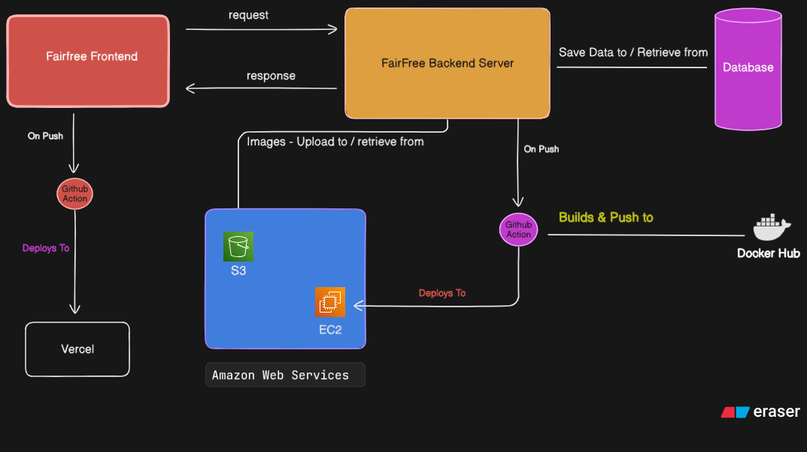

# 🎡 FairFree – A complete free platform for donation

FairFree is a service for a community-driven platform focused on reducing waste and enabling fair redistribution of usable items.

The platform helps individuals track item expiration dates, minimize unnecessary waste, and donate surplus items to community members in need. This platform provides secure authentication, core business logic, notification handling, and persistent data management for all system features.

The project is built using Spring Boot and follows clean architecture principles. It is designed to be production-ready (apart from some minor features and UI enhancements), scalable, and well-documented project.
---

## 👥 Team Members

- Nguyen Khanh, Tran – Scrum Master, Tech Lead
- Badri, Paudel – Project Owner, Full Stack Developer
- Dawit, Fsaha Welegebriel – Backend Developer
- Temuujin, Bat Amgalan – Front-end Developer, CI/CD Owner

---

## 🔗 Related Repositories

| Component | Repository |
|----------|------------|
| Frontend (React) | https://github.com/badripaudel77/FairFree_Front |
| Backend (Spring Boot) | You are here |

---

## 🏗️ Architecture & Workflow

### High-Level Workflow Diagram

The system follows a modular and layered architecture with clear separation of concerns between security, business logic, and persistence components.

---

## 🧩 Features (Backend)

- Authentication, Authorization, User & Role Management using Spring Security and JWT
- Item lifecycle management (creation, deletion and making available for donation of items)
- Donation and claim workflows (claiming the item, approving and denial of claims)
- Notification service for expiring items and donation events
- Cloud-ready architecture

---

## 🧰 Tech Stack

### Backend

- Java 25
- Spring Boot 4
- Maven
- Spring Security
- JWT Authentication
- RESTful APIs
- JUnit and Mockito for unit testing
- Testcontainers for integration testing

---

### Database

- PostgreSQL
- Flyway for database schema versioning and data migration

---

### Infrastructure & Cloud

- AWS EC2
- AWS S3 (image storage)
- Docker
- Docker Hub (container image registry)

---

### CI/CD & Deployment

- GitHub Actions for continuous integration and deployment
  - Build and test pipelines
  - Docker image build and push to Docker Hub
  - Automated deployment workflows
    
- Frontend build and deployment to Vercel

---

## 🚀 Deployment Overview

- Backend application is containerized using Docker
- Docker images are built, pushed, and pulled from Docker Hub
- GitHub Actions automates build, test, and deployment processes
- Media assets are stored in AWS S3
- Database changes are managed using Flyway migrations

---

## 📌 Project Goals

- Promote waste reduction and community support
- Apply real-world backend engineering best practices
- Serve as a reference implementation for modern Spring Boot applications

---

## 📄 License

This project was built as a part educational requirement.
